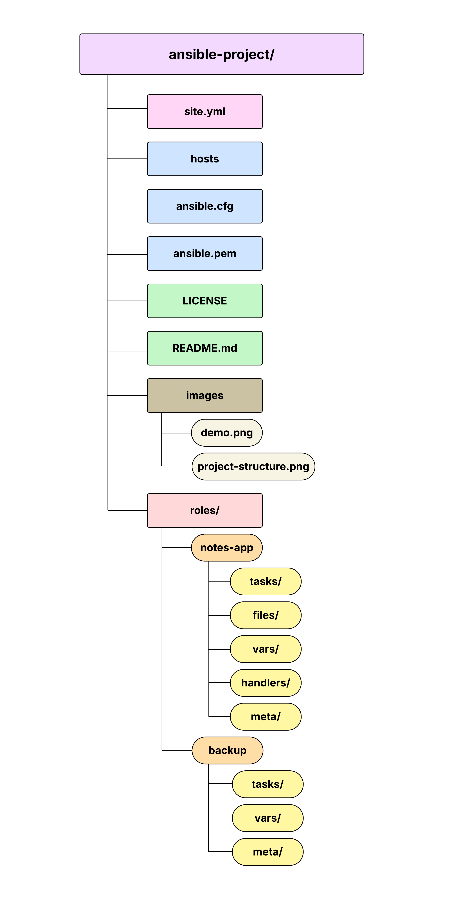

# 📝 Flask Notes App Deployment using Ansible on AWS EC2

## 📘 Project Description

This project automates the deployment of a simple **Flask-based note-taking web application** on an **AWS EC2 instance** using **Ansible roles**. The application allows users to write, view, and delete notes, which are stored in an SQLite database.

Additionally, the deployment includes:
- A **Systemd service** to run the Flask app persistently
- A **backup strategy** to copy the notes database hourly using a cron job

---

## 🚀 Technologies Used

- 🐍 Python 3
- 🔥 Flask
- 🗃️ SQLite
- ⚙️ Ansible
- ☁️ AWS EC2 (Amazon Linux 2)
- 📦 Systemd & Cron

---

## 📦 Project Structure

```
ansible-project/
├── site.yml
├── hosts
├── ansible.cfg
├── ansible.pem
├── LICENSE
├── README.md
├── images
│   ├── demo.png
│   └── project-structure.png
└── roles/
    ├── notes-app/
    │   ├── tasks/
    │   ├── files/
    │   ├── vars/
    │   ├── handlers/
    │   └── meta/
    └── backup/
        ├── tasks/
        ├── vars/
        └── meta/
```



---

## ✅ Prerequisites

Before you begin, ensure you have:

- ✅ AWS EC2 Instance (Amazon Linux 2, t2.micro)
- ✅ Key Pair for SSH access
- ✅ Security Group allows:
  - Port **22** (SSH)
  - Port **5000** (Flask app)
  - Port **80** (optional if you use port 80)
- ✅ Ansible installed on your local machine

---

## 🛠️ Deployment Steps

### 1. Clone the Project
```bash
git clone <your-repo-url>
cd ansible-project
```

### 2. Update the Inventory File (`hosts`)
Add your EC2 instance public IP:

```ini
[web]
<your-ec2-ip> ansible_user=ec2-user ansible_ssh_private_key_file=~/.ssh/your-key.pem
```

### 3. Run the Ansible Playbook
```bash
ansible-playbook -i hosts site.yml
```

### 4. Access the App in Your Browser
```
http://<your-ec2-ip>:5000
```

Or:
```
http://<your-ec2-ip>
```
if you configured the app to run on port 80.

---

## 🌟 Application Features

- 📝 Submit notes through a clean web interface
- 📆 Notes are timestamped and sorted by latest
- 🗑️ Delete individual notes
- 💾 Backups:
  - Every hour, `notes.db` is copied to `/opt/notes-app/backups/notes_<timestamp>.db`
  - Managed via `cron` on the EC2 instance

---

## 🧪 Sample User Flow

### User Input:
```
"Don't forget to review the IAM policy lecture notes."
```

### Displayed Output on the Web App:
```
🕒 2025-08-08 14:25:47
📌 Don't forget to review the IAM policy lecture notes.
```

---

## 🔐 Security Group Configuration

| Port | Description      |
|------|------------------|
| 22   | SSH access       |
| 5000 | Flask web app    |
| 80   | (Optional) HTTP  |

---

## 🔄 Restart / Stop the App Manually

```bash
sudo systemctl restart notes-app
sudo systemctl stop notes-app
```

---

## 🧼 Cleanup (optional)

To remove the deployed app:

```bash
sudo systemctl stop notes-app
sudo systemctl disable notes-app
sudo rm -rf /opt/notes-app
sudo rm /etc/systemd/system/notes-app.service
sudo systemctl daemon-reload
```

---

## Note
To can upload images from your device to server

- In terminal on my device, not inside server: 

```bash
scp -i key.pem /path/to/image.png ec2-user@<EC2_PUBLIC_IP>:/home/ec2-user/ansible-project/images/
```

---

## ✅ Done!

Your Notes App is live and backed up! 🎉

## 📸 Application Screenshot


---

## 📬 Author

- **Name:** Aya Elhwary  
- **Track:** DevOps (Deployment Project) 
- **Email:** elhwarya810@gmail.com 

---

## 📄 License

This project is licensed under the [MIT License](./LICENSE).

---